# EC2 - Elastic Compute Cloud

> Practice completed on: February 13, 2026

## Video Tutorial

📹 [Watch the EC2 Practice Video](ec2.mp4)

## Overview

This practice demonstrates how to launch an EC2 instance in AWS, configure security groups, connect via SSH, and manage the instance lifecycle. EC2 (Elastic Compute Cloud) is AWS's virtual server service that provides scalable computing capacity in the cloud.

## Prerequisites

- [x] AWS Account (Free Tier eligible)
- [x] SSH client installed (PuTTY for Windows, or built-in ssh command)
- [x] Basic understanding of Linux command line
- [x] Basic networking knowledge (IP addresses, ports, security)

## Step-by-Step Walkthrough

### Step 1: AWS Management Console

Starting point - accessing the AWS Management Console to begin the EC2 instance creation process.

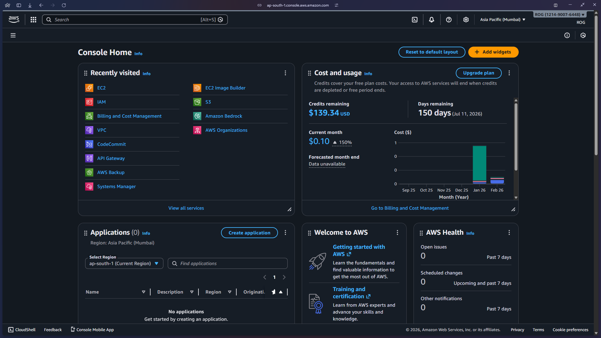

**Key Points:**
- Navigate to EC2 service from the AWS Console
- Ensure you're in the correct AWS region (check top-right corner)

---

### Step 2: Launch Instance

Initiating the EC2 instance launch wizard to configure and create a new virtual machine.

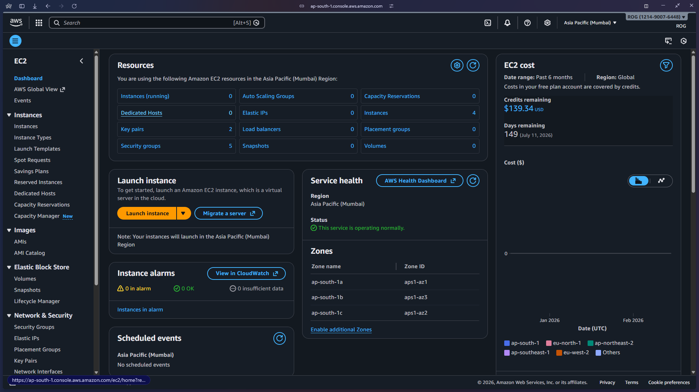

**Key Points:**
- Click "Launch Instance" button to start the configuration process
- You'll configure multiple settings before the instance is created

---

### Step 3: Instance Configuration

Configuring basic instance details including name, AMI selection, and instance type.

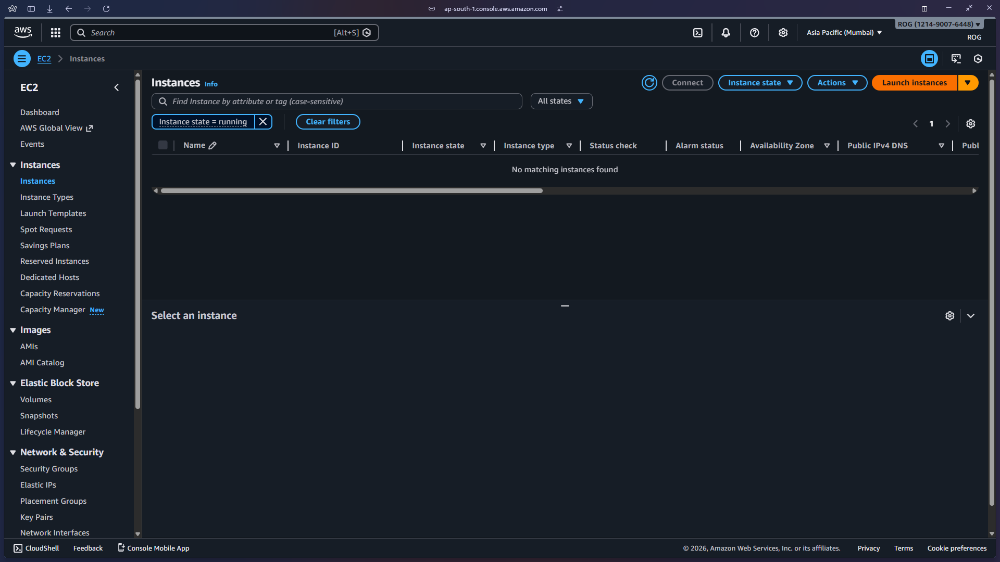

**Key Points:**
- Choose a meaningful name for your instance
- Select Amazon Machine Image (AMI) - Amazon Linux 2 or Ubuntu are common free tier options
- Select instance type - t2.micro is free tier eligible

---

### Step 4: Key Pair Configuration

Creating or selecting a key pair for secure SSH access to the EC2 instance.

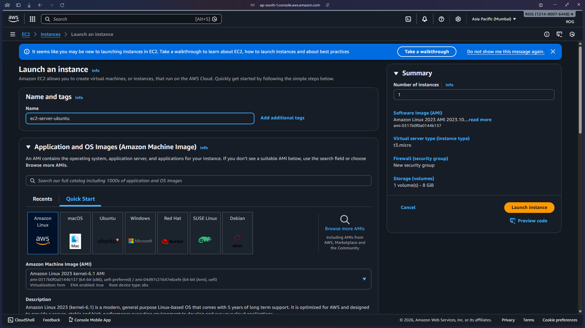

**Key Points:**
- Key pairs are essential for SSH authentication
- Download the .pem file immediately - you cannot retrieve it later
- Store the key file securely - it's like a password for your instance

---

### Step 5: Network Settings

Configuring network and security group settings to control inbound and outbound traffic.

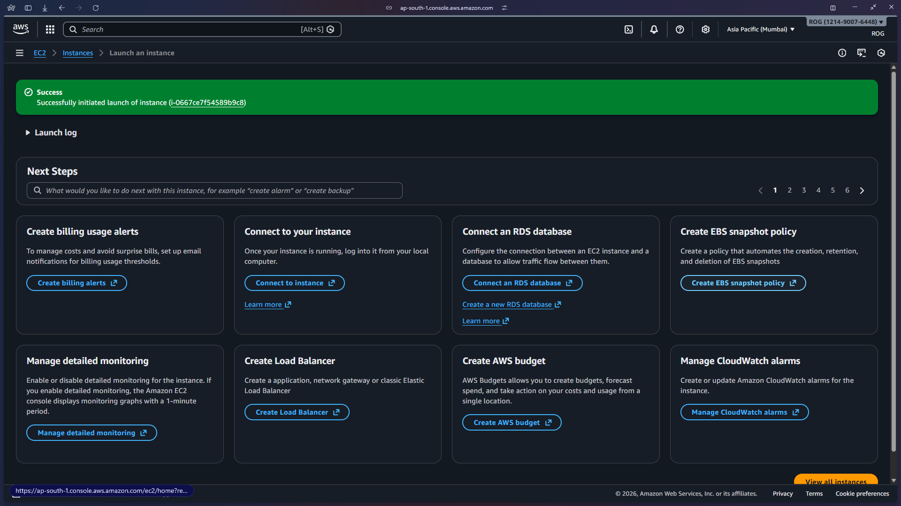

**Key Points:**
- Security groups act as virtual firewalls
- SSH (port 22) must be allowed for remote access
- Consider restricting SSH access to your IP address for better security

---

### Step 6: Security Group Rules

Detailed configuration of security group rules defining which ports and protocols are accessible.

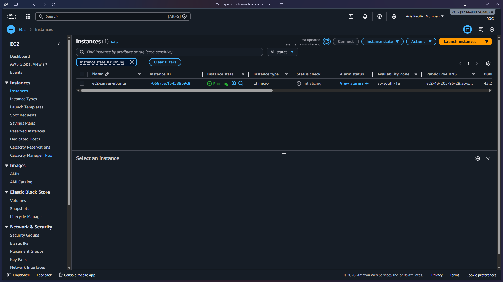

**Key Points:**
- Default SSH rule allows connection from anywhere (0.0.0.0/0)
- For production, always restrict source IP addresses
- Additional rules can be added for HTTP (80), HTTPS (443), or custom applications

---

### Step 7: Storage Configuration

Configuring the root volume and additional storage for the EC2 instance.

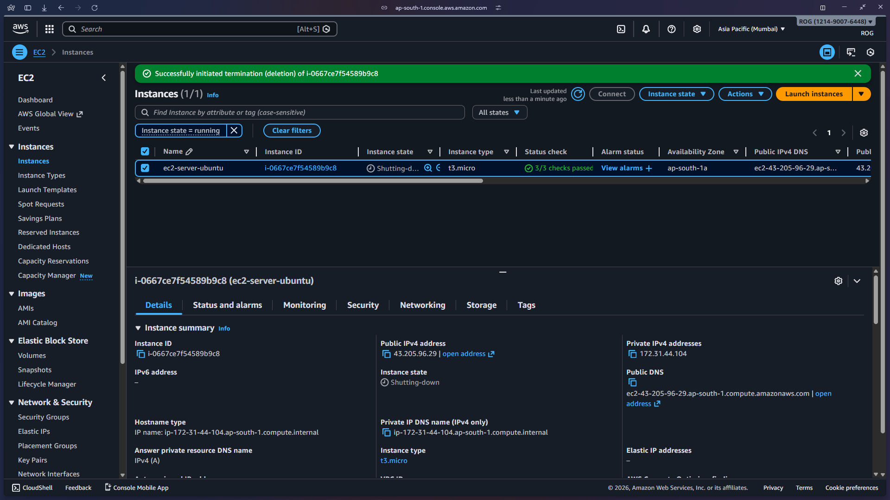

**Key Points:**
- Default is 8 GB general purpose SSD (gp2/gp3)
- Free tier includes up to 30 GB of EBS storage
- Volume is deleted on instance termination by default (can be changed)

---

### Step 8: Review and Launch

Final review of all configurations before launching the instance.

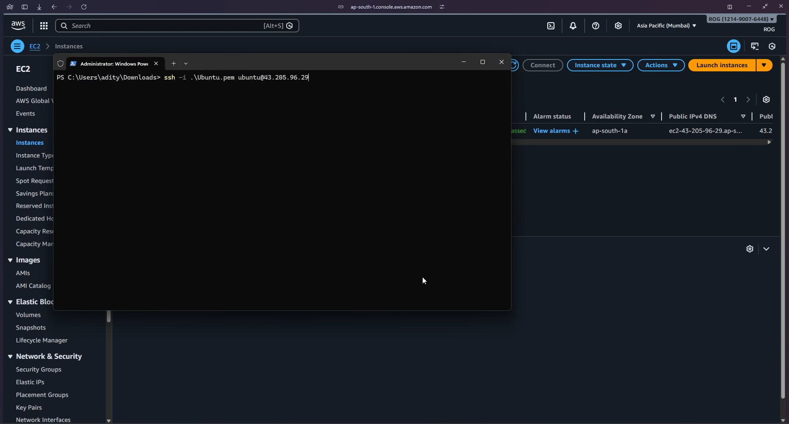

**Key Points:**
- Double-check all settings before launching
- Instance type, security groups, and key pair cannot be changed after creation (without stopping)
- Confirm you have the key pair file downloaded

---

### Step 9: Instance Launching

Instance creation in progress - AWS is provisioning the virtual machine.

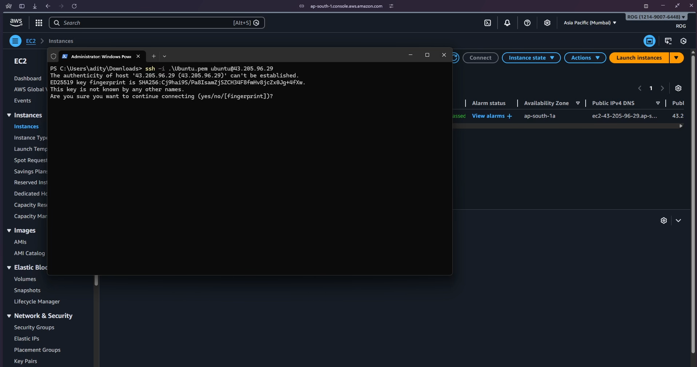

**Key Points:**
- Instance goes through several states: pending → running
- Usually takes 1-2 minutes to fully initialize
- You can view instance details and status from the EC2 dashboard

---

### Step 10: Instance Running

Instance is now running and ready for connection - view instance details and public IP.

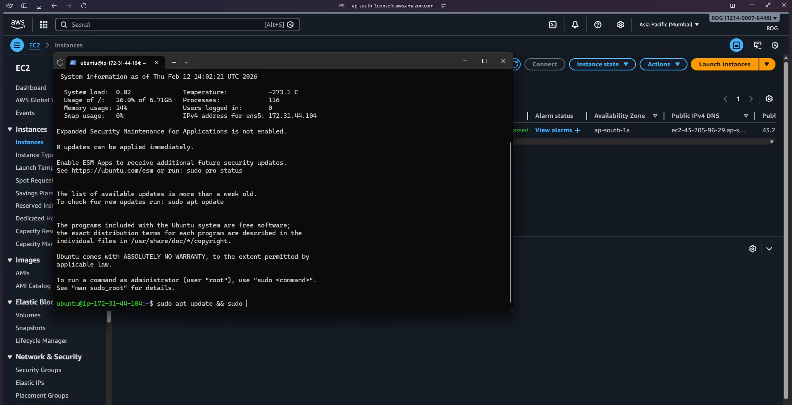

**Key Points:**
- Instance state shows "Running" with a green indicator
- Public IPv4 address is assigned (needed for SSH connection)
- Instance ID uniquely identifies your EC2 instance

---

### Step 11: SSH Connection Details

Preparing to connect to the instance via SSH using the key pair and public IP address.

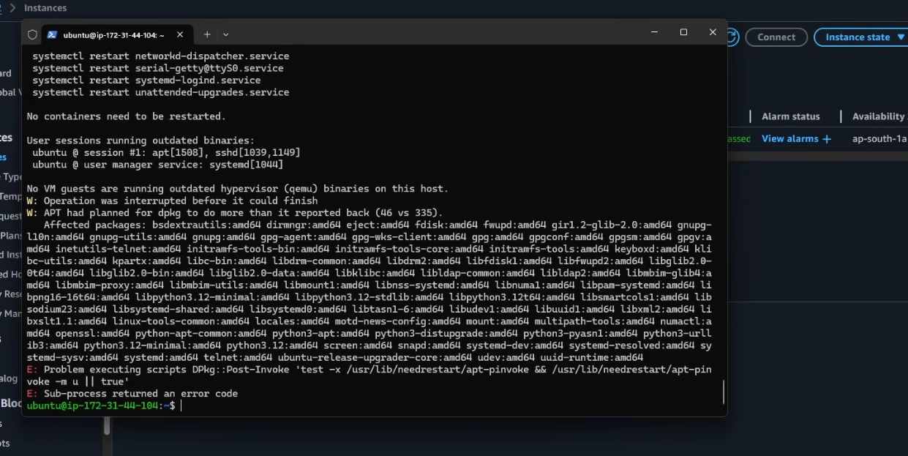

**Key Points:**
- Use the Connect button to see detailed SSH instructions
- Connection command format: `ssh -i "keyfile.pem" ec2-user@public-ip`
- For Windows users: Use PuTTY or Windows SSH client
- First connection will prompt to verify the host fingerprint

---

## Key Concepts Learned

- **EC2 Instance:** Virtual server in AWS cloud that you can configure and control
- **AMI (Amazon Machine Image):** Pre-configured template containing the OS and software
- **Instance Type:** Defines the CPU, memory, storage, and networking capacity (e.g., t2.micro)
- **Key Pair:** Public-private key pair used for secure SSH authentication
- **Security Group:** Virtual firewall controlling inbound and outbound traffic rules
- **EBS (Elastic Block Store):** Persistent block storage volumes for EC2 instances
- **Public IP:** Internet-accessible IP address assigned to your instance
- **SSH (Secure Shell):** Encrypted protocol for secure remote access to Linux instances

## Video Walkthrough

Complete demonstration of launching an EC2 instance and connecting via SSH:

This video walks through the entire process from creating the instance to successfully establishing an SSH connection.

## Troubleshooting

### Issue: Cannot connect via SSH - Connection timeout
**Solution:** 
- Check security group allows SSH (port 22) from your IP address
- Verify you're using the correct public IP address
- Ensure your internet connection isn't blocking outbound SSH traffic

### Issue: Permission denied (publickey) error
**Solution:**
- Verify you're using the correct key pair file (.pem)
- Check key file permissions: `chmod 400 keyfile.pem` on Linux/Mac
- Ensure you're using the correct username (ec2-user for Amazon Linux, ubuntu for Ubuntu)

### Issue: Key file permissions too open
**Solution:**
- On Linux/Mac: Run `chmod 400 keyfile.pem`
- On Windows: Right-click key file → Properties → Security → Advanced → Disable inheritance

## Next Steps

**Related AWS Services to Practice:**
- **EBS Volumes:** Attach additional storage to EC2 instances
- **Elastic IP:** Associate a static IP address to your instance
- **Load Balancers:** Distribute traffic across multiple EC2 instances
- **Auto Scaling:** Automatically adjust instance capacity based on demand
- **CloudWatch:** Monitor instance performance and set up alarms

**Recommended Next Practice:**
- [Application Load Balancer](../ALB/README.md) - Learn to distribute traffic
- [S3 Integration](../S3/README.md) - Store and retrieve files from EC2
- [VPC Configuration](../VPC/README.md) - Understand AWS networking

## Resources

- [AWS EC2 Documentation](https://docs.aws.amazon.com/ec2/)
- [EC2 Instance Types](https://aws.amazon.com/ec2/instance-types/)
- [Security Groups Best Practices](https://docs.aws.amazon.com/vpc/latest/userguide/VPC_SecurityGroups.html)
- [SSH Connection Guide](https://docs.aws.amazon.com/AWSEC2/latest/UserGuide/AccessingInstancesLinux.html)

---

[↑ Back to Practice Index](../../README.md)
