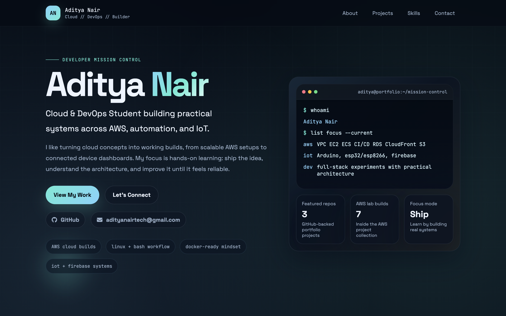
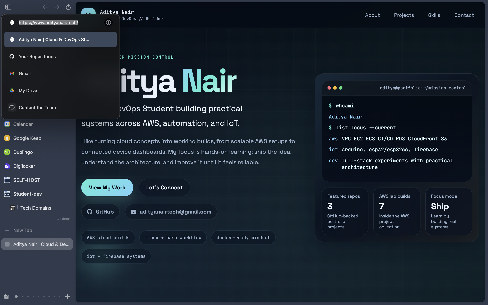
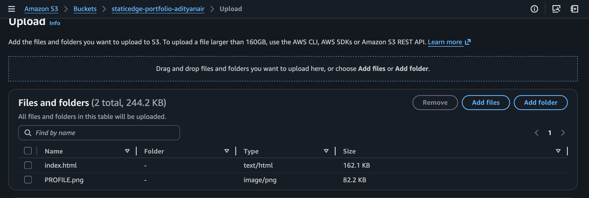
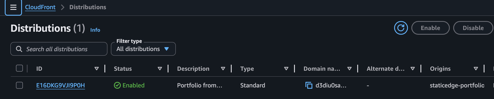
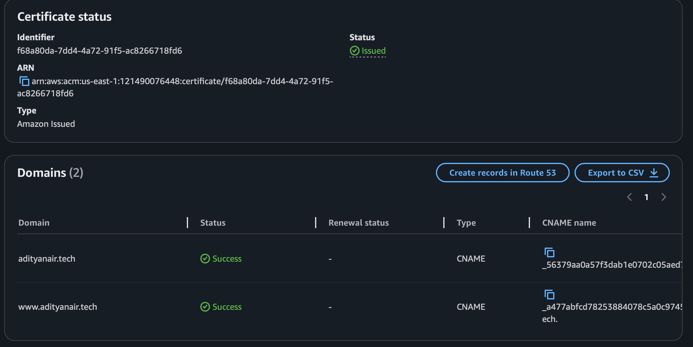
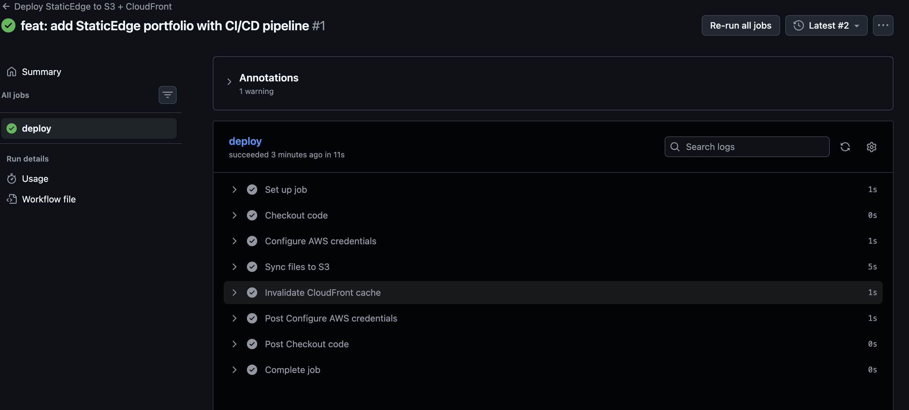
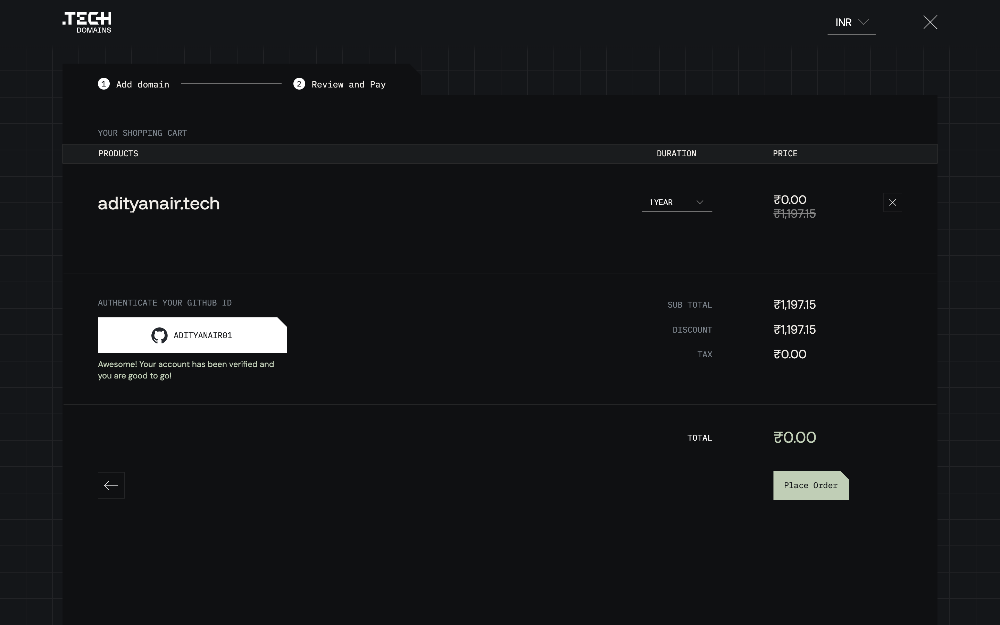

# AWS-PORTFOLIO

# PortfolioEdge | Personal Portfolio on AWS

> Personal portfolio website hosted on AWS S3 + CloudFront with automated CI/CD via GitHub Actions and a custom domain with HTTPS.

🌐 **Live:** [https://www.adityanair.tech](https://www.adityanair.tech)

> 💡 Portfolio source code is kept in a private repository.
> The CI/CD pipeline, infrastructure setup, and architecture are fully documented here.

---
##  📸 Screenshots

Images are located in the `images/` folder.

### Live Site at Custom Domain

---

---
### S3 Bucket — Files Uploaded


### CloudFront Distribution — Enabled


### ACM Certificate — Issued


### GitHub Actions — Successful Deploy


### Custom Domain with .tech domain redeemed with Github Education Plan



---
## Architecture

```
User visits https://adityanair.tech
         |
         ▼
Domain Forwarding at get.tech registrar
(301 redirect to www.adityanair.tech)
         |
         ▼
https://www.adityanair.tech
         |
         ▼
 +-------------------------+
 |  AWS CloudFront (CDN)   |
 |  - Global edge caching  |
 |  - HTTPS via ACM cert   |
 |  - OAC to S3            |
 +-------------------------+
         |
         ▼
 +-------------------------+
 |  AWS S3 (Private Bucket)|
 |  - No public access     |
 |  - OAC policy only      |
 +-------------------------+
         ^
         |
 +---------------------------+
 |  GitHub Actions CI/CD     |
 |  - Triggered on push      |
 |  - S3 sync + CF invalidate|
 +---------------------------+
```

---

## AWS Services Used

| Service | Purpose |
|---|---|
| Amazon S3 | Static file hosting (private bucket) |
| Amazon CloudFront | CDN, HTTPS termination, global edge caching |
| AWS ACM | Free SSL/TLS certificate for custom domain |
| AWS IAM | Scoped credentials for GitHub Actions |
| GitHub Actions | CI/CD pipeline — auto-deploy on push |

---

## Key Cloud Concepts Demonstrated

- **Private S3 + OAC** — Bucket is fully private; CloudFront accesses it via Origin Access Control (OAC), the modern replacement for OAI
- **CDN edge caching** — CloudFront serves cached content from global edge locations for low latency worldwide
- **HTTPS everywhere** — ACM-issued SSL certificate attached to CloudFront; HTTP auto-redirects to HTTPS
- **Custom domain** — `.tech` domain pointed to CloudFront via CNAME; root domain forwarded to `www` subdomain
- **CI/CD pipeline** — GitHub Actions automatically syncs S3 and invalidates CloudFront cache on every `git push` to `main`
- **Cache invalidation** — `/*` invalidation ensures visitors always get the latest version after each deploy
- **Least privilege IAM** — GitHub Actions uses a dedicated IAM user with only S3 and CloudFront permissions

---

## CI/CD Pipeline

Every push to `main` in the private portfolio repo triggers the following workflow:

```yaml
name: Deploy StaticEdge to S3 + CloudFront

on:
  push:
    branches:
      - main

jobs:
  deploy:
    runs-on: ubuntu-latest

    steps:
      - name: Checkout code
        uses: actions/checkout@v3

      - name: Configure AWS credentials
        uses: aws-actions/configure-aws-credentials@v2
        with:
          aws-access-key-id: ${{ secrets.AWS_ACCESS_KEY_ID }}
          aws-secret-access-key: ${{ secrets.AWS_SECRET_ACCESS_KEY }}
          aws-region: ${{ secrets.AWS_REGION }}

      - name: Sync files to S3
        run: |
          aws s3 sync . s3://${{ secrets.S3_BUCKET }} \
            --delete \
            --cache-control "max-age=86400" \
            --exclude ".git/*" \
            --exclude ".github/*" \
            --exclude "README.md"

      - name: Invalidate CloudFront cache
        run: |
          aws cloudfront create-invalidation \
            --distribution-id ${{ secrets.CLOUDFRONT_DISTRIBUTION_ID }} \
            --paths "/*"
```

**Deploy time: ~16 seconds** ⚡

---

## Infrastructure Setup

### S3 Bucket
- **Region:** ap-south-1 (Mumbai)
- **Access:** Private — all public access blocked
- **Bucket policy:** OAC policy allowing only CloudFront distribution `E16DKG9VJI9P0H`

### CloudFront Distribution
- **Distribution ID:** `E16DKG9VJI9P0H`
- **Domain:** `d3diu0sa9fueaw.cloudfront.net`
- **Alternate domains:** `adityanair.tech`, `www.adityanair.tech`
- **Origin access:** OAC (Origin Access Control) — recommended method
- **Viewer protocol:** Redirect HTTP → HTTPS
- **Default root object:** `index.html`
- **Price class:** All edge locations

### SSL Certificate (ACM)
- **Region:** us-east-1 (required for CloudFront)
- **Domains covered:** `adityanair.tech`, `www.adityanair.tech`
- **Validation:** DNS validation via CNAME records at get.tech

### Custom Domain
- **Registrar:** get.tech (via GitHub Education Student Pack — free 1 year)
- **Root domain:** `adityanair.tech` → forwarded to `www.adityanair.tech` via Domain Forwarding
- **www subdomain:** CNAME → `d3diu0sa9fueaw.cloudfront.net`

### IAM
- **User:** `github-actions-staticedge`
- **Policies:** `AmazonS3FullAccess`, `CloudFrontFullAccess`
- **Usage:** GitHub Actions secrets (never hardcoded)

---

## GitHub Secrets Required

| Secret | Description |
|---|---|
| `AWS_ACCESS_KEY_ID` | IAM user access key |
| `AWS_SECRET_ACCESS_KEY` | IAM user secret key |
| `AWS_REGION` | `ap-south-1` |
| `S3_BUCKET` | S3 bucket name |
| `CLOUDFRONT_DISTRIBUTION_ID` | CloudFront distribution ID |

---


## Author

**Aditya Nair**
- GitHub: [@ADITYANAIR01](https://github.com/ADITYANAIR01)
- Portfolio: [https://www.adityanair.tech](https://www.adityanair.tech)