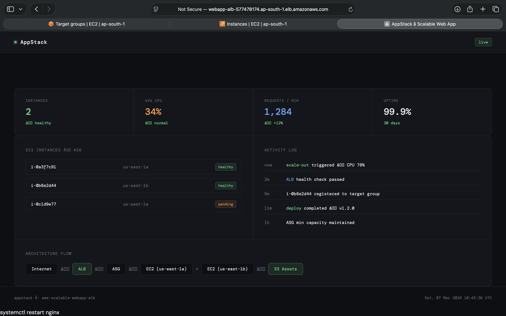
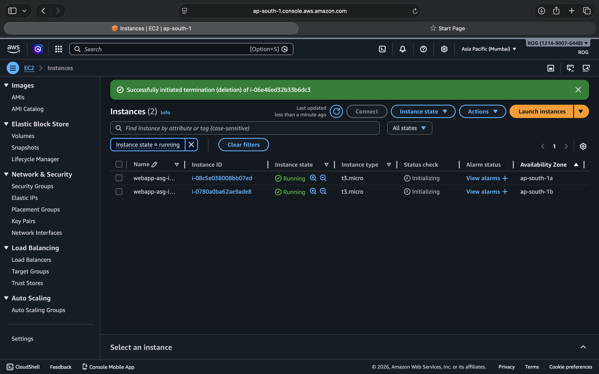
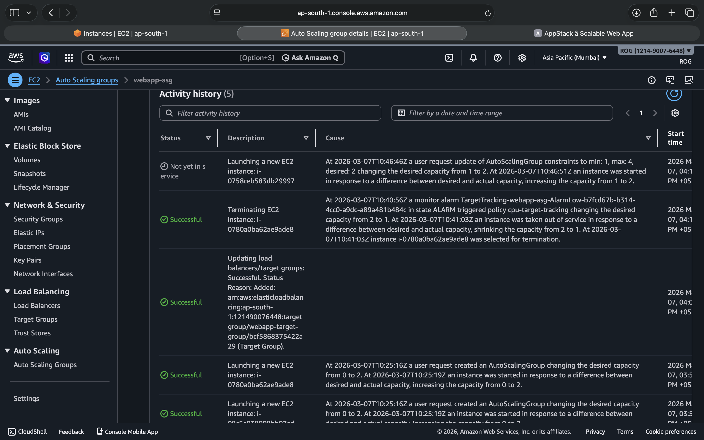
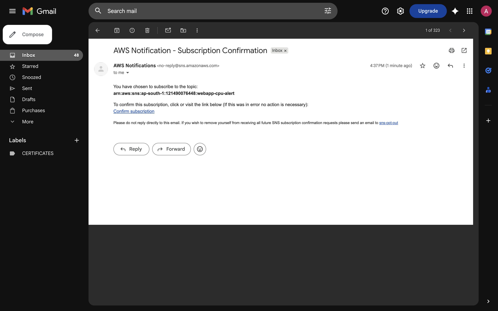
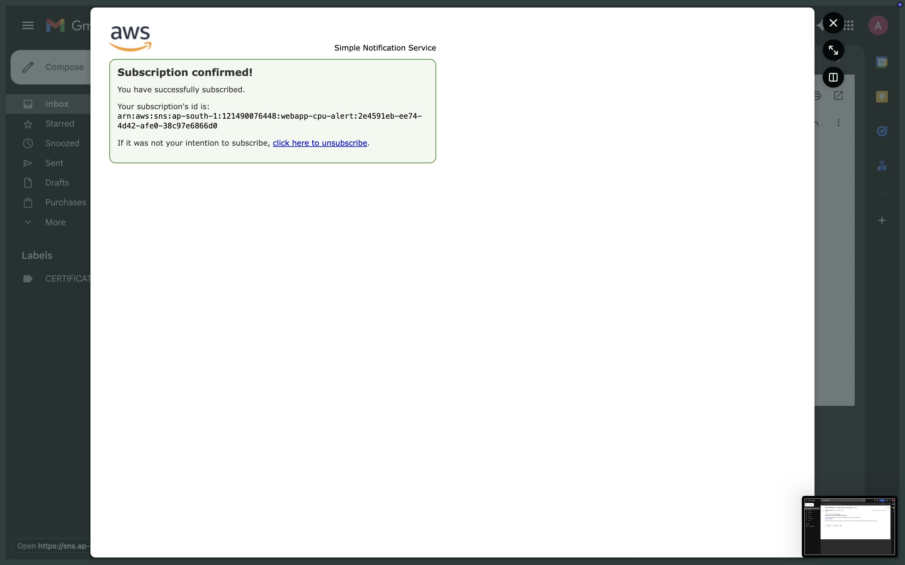
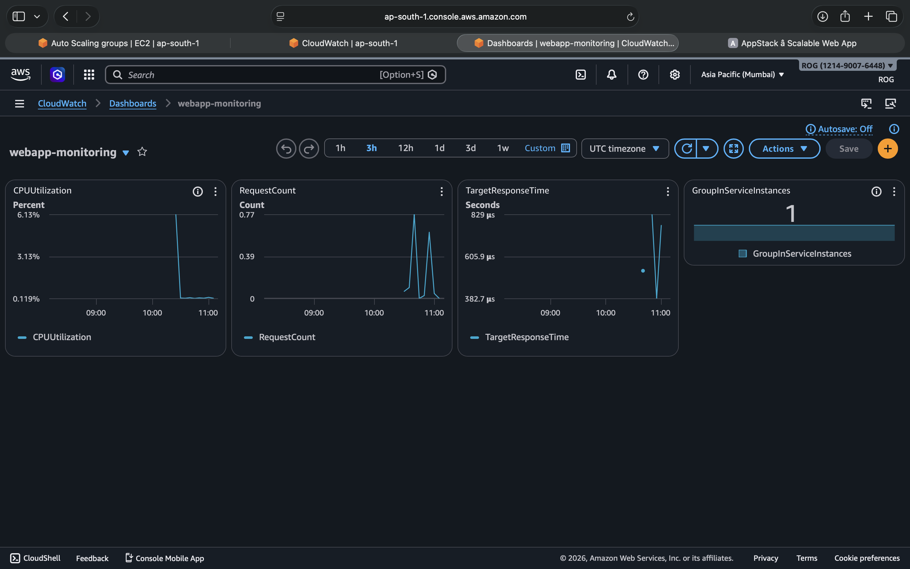

# 🚀 AWS Scalable Web Application — ALB + ASG

A production-grade, self-healing web application deployed on AWS using an Application Load Balancer, Auto Scaling Group, and EC2 across multiple Availability Zones. Mimics how platforms like **Heroku / Railway** manage scalable deployments automatically.

---

## 📸 Screenshots

> All build screenshots are available in the [`/images`](./images) folder, numbered `1` through `81` in chronological build order.

**Key screenshots inline:**

### App Running via ALB DNS

> App served through the Application Load Balancer DNS — no direct EC2 IP

### Target Group — Both Instances Healthy in different AZ's

> Both EC2 instances passing health checks across two Availability Zones

### Auto Scaling Group — Instance Management after deleting 

> ASG maintaining desired capacity across `ap-south-1a` and `ap-south-1b` after terminating an ec2 machine to check for auto healing

### AWS Notification -Subscription email



>Confirmed notification subscription

### CloudWatch Monitoring Dashboard

> Real-time metrics — CPU, request count, response time, instance count

----

## 🏗️ Architecture

```
Internet
    │
    ▼
Internet Gateway (scalable-webapp-igw)
    │
    ▼
┌─────────────────────────────────────────────────────────┐
│  VPC: scalable-webapp-vpc (10.0.0.0/16)                 │
│                                                         │
│  ┌──────────────────┐     ┌──────────────────┐          │
│  │ public-subnet-1a │     │ public-subnet-1b │          │
│  │  10.0.1.0/24     │     │  10.0.2.0/24     │          │
│  └──────────────────┘     └──────────────────┘          │
│            │                        │                   │
│            ▼                        ▼                   │
│   Application Load Balancer (webapp-alb)                │
│            │  HTTP :80 Listener                         │
│            ▼                                            │
│   Target Group (webapp-target-group)                    │
│    ├──▶ EC2 t3.micro — ap-south-1a  ✓ healthy           │
│    └──▶ EC2 t3.micro — ap-south-1b  ✓ healthy           │
│              ▲                                          │
│    Auto Scaling Group (webapp-asg)                      │
│    min: 1 │ desired: 2 │ max: 4                         │
│    CPU > 50% → scale out                                │
│    CPU < 30% → scale in                                 │
│              │                                          │
│    Launch Template (webapp-launch-template)             │
│    Amazon Linux 2023 + nginx                            │
└─────────────────────────────────────────────────────────┘
```

---

## ⚙️ AWS Services Used

| Service | Purpose |
|---|---|
| **VPC** | Isolated network with public subnets across 2 AZs |
| **EC2** | Compute — runs nginx web server |
| **Application Load Balancer** | Distributes traffic, health checks, single DNS entry |
| **Auto Scaling Group** | Automatically adds/removes instances based on CPU |
| **Launch Template** | Blueprint for identical EC2 instances |
| **IAM Role** | EC2 permissions for S3 and CloudWatch |
| **CloudWatch** | Metrics dashboard + CPU alarm via SNS email |
| **Security Groups** | Layered firewall — ALB faces internet, EC2 accepts ALB only |

---

## 🔐 Security Design

```
Internet → alb-sg (HTTP 0.0.0.0/0)
                ↓
           ec2-sg (HTTP from alb-sg ONLY)
```

EC2 instances are **not directly reachable** from the internet. All public traffic flows through the ALB only. This is a standard production security pattern.

---

## 📦 Infrastructure Summary

### VPC & Networking
| Resource | Value |
|---|---|
| VPC CIDR | `10.0.0.0/16` |
| Public Subnet 1 | `10.0.1.0/24` — ap-south-1a |
| Public Subnet 2 | `10.0.2.0/24` — ap-south-1b |
| Internet Gateway | Attached to VPC |
| Route Table | `0.0.0.0/0 → IGW` |

### Compute
| Resource | Value |
|---|---|
| AMI | Amazon Linux 2023 |
| Instance Type | t3.micro |
| Web Server | nginx |
| Deployment | User data script on launch |

### Auto Scaling
| Setting | Value |
|---|---|
| Minimum | 1 |
| Desired | 2 |
| Maximum | 4 |
| Scale-out trigger | CPU > 50% |
| Scale-in trigger | CPU < 30% |

### Monitoring
| Resource | Value |
|---|---|
| Dashboard | `webapp-monitoring` |
| Alarm | `webapp-high-cpu` — triggers at 70% |
| Notification | SNS email alert |

---

## 🛠️ Build Phases

| Phase | What was built |
|---|---|
| 1 — Networking | VPC, subnets, IGW, route table, security groups |
| 2 — Compute | Launch template, IAM role, test EC2, nginx + web app |
| 3 — Auto Scaling | ASG with target tracking scaling policy |
| 4 — Load Balancer | ALB, target group, listener, ASG integration |
| 5 — Monitoring | CloudWatch dashboard, CPU alarm, SNS notification |

---

## 💡 Key Cloud Concepts Demonstrated

- **High Availability** — workload spread across 2 Availability Zones
- **Horizontal Scaling** — ASG adds instances under load, removes them when idle
- **Self-healing Infrastructure** — failed instances are automatically replaced by ASG
- **Security Layering** — EC2 not exposed directly, traffic flows ALB → EC2 only
- **Infrastructure as a Blueprint** — Launch Templates ensure every instance is identical
- **Observability** — CloudWatch dashboard + proactive alerting via SNS

---

## 🧹 Cleanup

To avoid AWS charges after testing:

1. Delete **Auto Scaling Group** (this terminates all EC2 instances)
2. Delete **Application Load Balancer**
3. Delete **Target Group**
4. Delete **Launch Template**
5. Delete **CloudWatch Alarms and Dashboard**
6. Delete **VPC** (also removes subnets, IGW, route tables, security groups)
7. Delete **IAM Role** `ec2-webapp-role`
8. Delete **SNS Topic** `webapp-cpu-alert`

---

## 📁 Repository Structure

```
aws-scalable-webapp-alb/
├── index.html          # Web app deployed on EC2 via nginx
├── README.md           # This file
└── images/             # All build screenshots (1–70, in chronological order)
```

---

##  Learning Journey

Built as part of a hands-on AWS Cloud & DevOps learning journey.