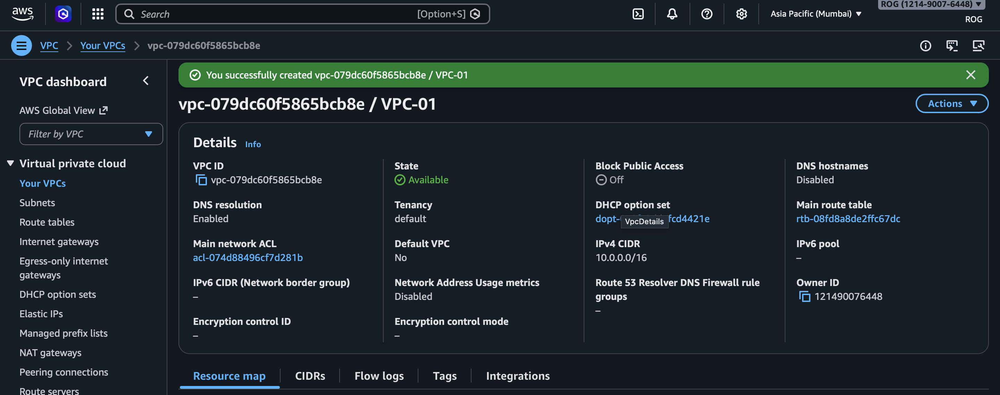
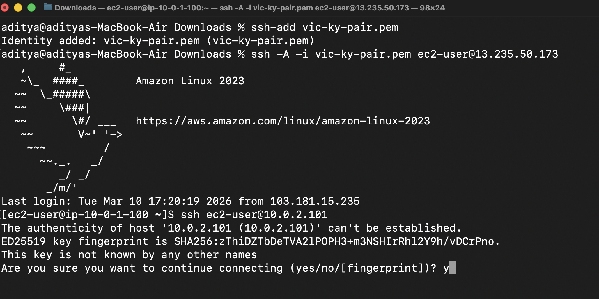
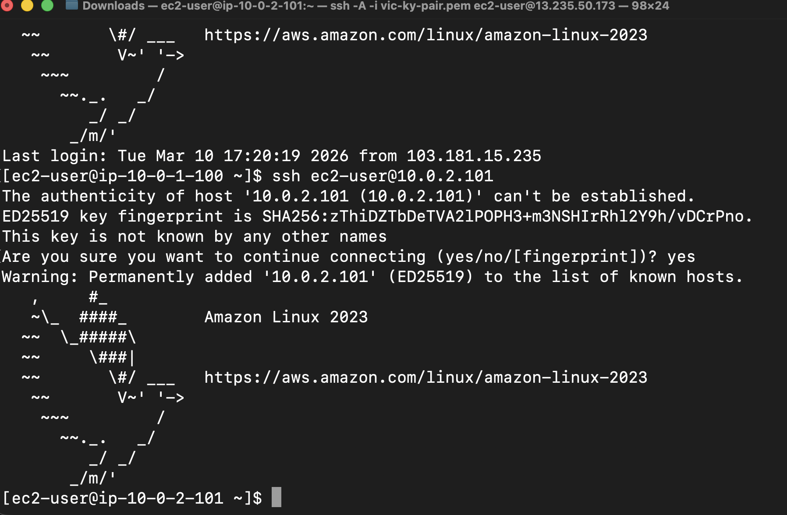
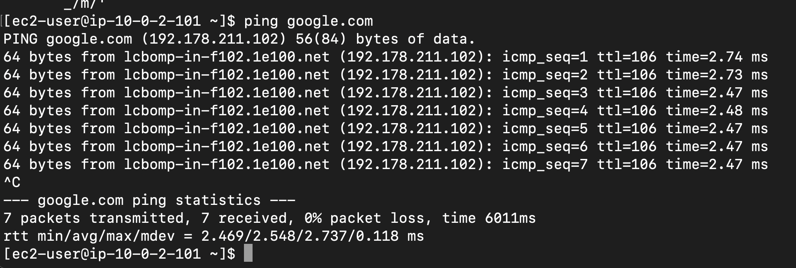

# AWS VPC From Scratch

A production-style AWS Virtual Private Cloud (VPC) built
from scratch with public/private subnet isolation,
Bastion Host access pattern, NAT Gateway,
and multi-layer network security.

---
## 📸 Screenshots

> All build screenshots are available in the [`/images`](./images) folder, numbered `1` through `36` in chronological build order.
---

### VPC Dashboard


### SSH into Bastion


### SSH Jump to Private EC2


### Internet Test

---
## Architecture
```
┌─────────────────────────────────────────────────┐
│                VPC (10.0.0.0/16)                │
│                                                 │
│  ┌───────────────────────┐                      │
│  │   Public Subnet       │                      │
│  │   10.0.1.0/24         │                      │
│  │                       │                      │
│  │  [Bastion Host EC2]   │                      │
│  │  [NAT Gateway]        │                      │
│  └──────────┬────────────┘                      │
│             │ SSH Jump                          │
│  ┌──────────▼────────────┐                      │
│  │   Private Subnet      │                      │
│  │   10.0.2.0/24         │                      │
│  │                       │                      │
│  │  [Private EC2]        │                      │
│  │  (No Public IP)       │                      │
│  └───────────────────────┘                      │
│                                                 │
│  public-rt  → IGW   (internet in + out)         │
│  private-rt → NAT   (outbound only)             │
└─────────────────────┬───────────────────────────┘
                      │
              [Internet Gateway]
                      │
                  Internet
```

---

## AWS Services Used

- VPC + Subnets (Public & Private)
- Internet Gateway
- NAT Gateway
- Route Tables
- Security Groups
- Network ACLs (NACLs)
- EC2 (Bastion Host + Private Instance)

---

## Network Design

| Component | Value |
|---|---|
| VPC CIDR | 10.0.0.0/16 |
| Public Subnet | 10.0.1.0/24 |
| Private Subnet | 10.0.2.0/24 |
| Bastion Host | Public Subnet — t2.micro |
| Private EC2 | Private Subnet — t2.micro (no public IP) |

---

## Security Design

### Security Groups (Instance Level)
| SG | Inbound Rule |
|---|---|
| bastion-sg | SSH port 22 from my IP only (/32) |
| private-ec2-sg | SSH port 22 from bastion-sg only |

### NACLs (Subnet Level)
| NACL | Inbound Rules |
|---|---|
| public-nacl | Allow SSH (22) + Ephemeral ports (1024-65535) |
| private-nacl | Allow SSH from 10.0.1.0/24 + Ephemeral ports |

---

## Key Concepts Demonstrated

- Public vs Private subnet isolation
- Internet Gateway vs NAT Gateway
- Bastion Host / Jump Server pattern
- Stateful (SG) vs Stateless (NACL) firewalls
- Defense-in-depth network security
- CIDR block planning

---

## Test Results

| Test | Result |
|---|---|
| SSH into Bastion Host | ✅ |
| SSH jump to Private EC2 via Bastion | ✅ |
| ping google.com from Private EC2 | ✅ |
| Private EC2 unreachable from internet directly | ✅ |
| NACL IP block test | ✅ |

---
## 👨‍💻 Author

**Aditya Nair**
- GitHub: [@ADITYANAIR01](https://github.com/ADITYANAIR01)
- LinkedIn: [linkedin.com/in/adityanair001](https://www.linkedin.com/in/adityanair001)

---