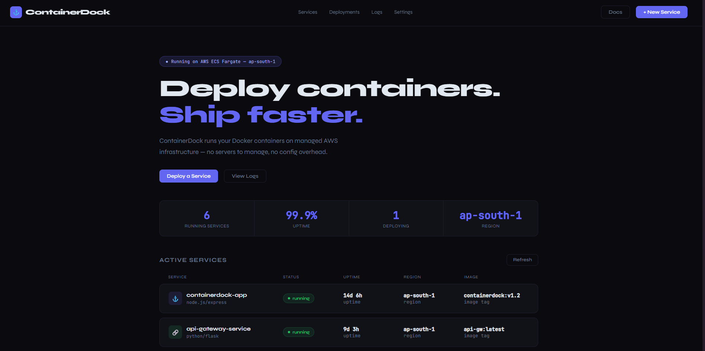
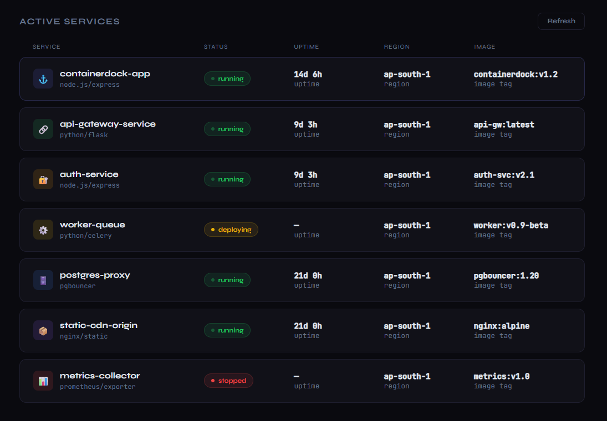
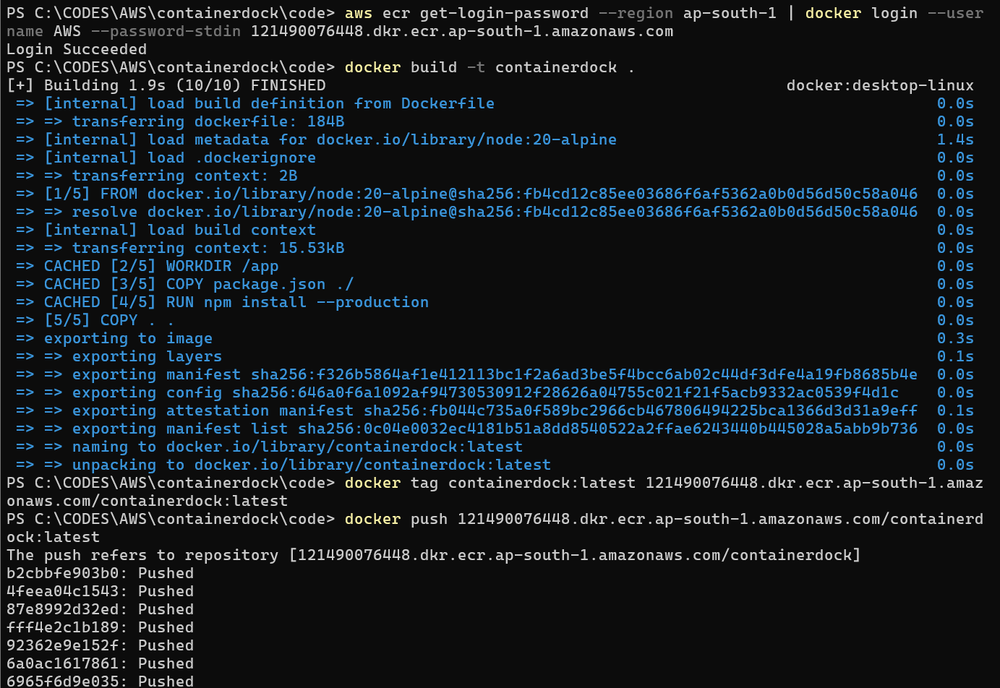
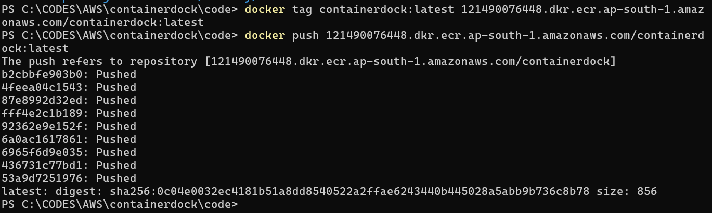

# CONTAINERDOCK

A self-hosted container deployment platform built on AWS ECS Fargate — mimicking platforms like Railway and Render.

---

## Screenshots

All images are located in the [`/images`](./images) folder in chronological order.

### Website Screenshots




### Code pushed from local to Aws Elastic Container Registry




## Architecture

This project deploys a Dockerized Node.js app from [`/code`](./code) to AWS ECS Fargate behind an Application Load Balancer.

```text
Developer
   |
   | docker build, tag, push
   v
Amazon ECR (private repository)
   |
   | image pull (task execution role)
   v
Amazon ECS Cluster (Fargate launch type)
   |
   | ECS Service maintains desired task count
   v
Fargate Tasks (container from ECR image)
   |
   | target group health checks
   v
Application Load Balancer (HTTP/HTTPS listener)
   |
   v
End Users (browser)

Logs/metrics flow: ECS tasks -> CloudWatch Logs
````

### Why This Architecture Fits This Project

- The app is a stateless Node.js web server, so ECS Fargate is a clean fit without EC2 management.
- Docker image versioning in ECR matches the local build workflow used in this project.
- ALB provides a single public entrypoint and routes traffic to healthy tasks.
- CloudWatch logs provide runtime visibility for container output and troubleshooting.

## Stack

- ECR — private Docker image registry
- ECS Fargate — serverless container orchestration
- ALB — HTTPS load balancer with ACM certificate
- VPC — isolated network with public/private subnets
- CloudWatch — container log aggregation
- IAM — scoped task execution role

## Key Concepts

- Containerizing a Node.js app with Docker
- Pushing images to a private ECR registry
- Defining ECS task definitions (CPU, memory, ports, env vars)
- Running Fargate services behind an ALB
- Health checks and auto-restart on task failure
- Container log routing to CloudWatch

---

## 👨‍💻 Author

### Aditya Nair

- GitHub: [@ADITYANAIR01](https://github.com/ADITYANAIR01)

- LinkedIn: [linkedin.com/in/adityanair001](https://www.linkedin.com/in/adityanair001)
