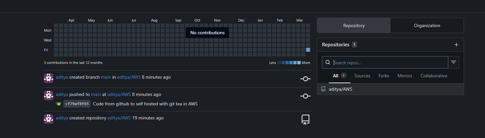
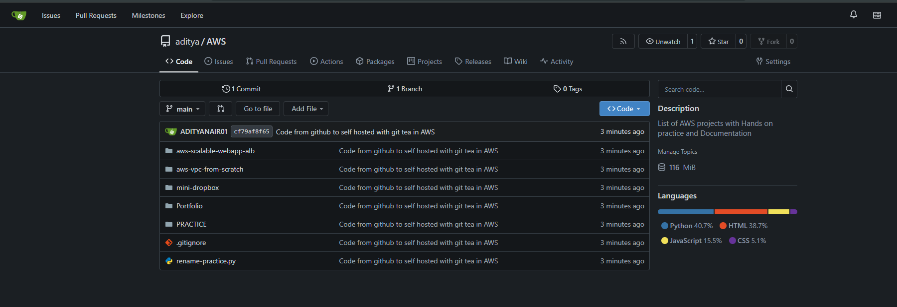
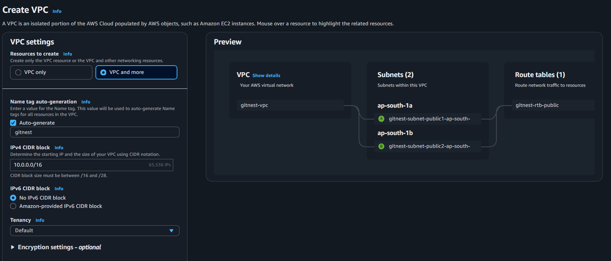
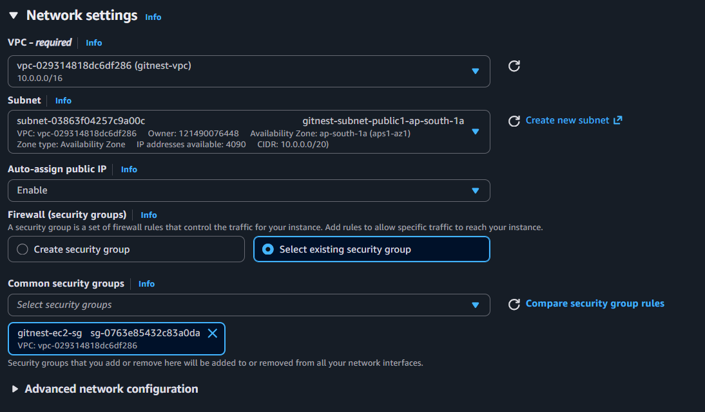
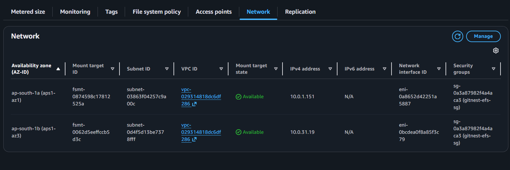
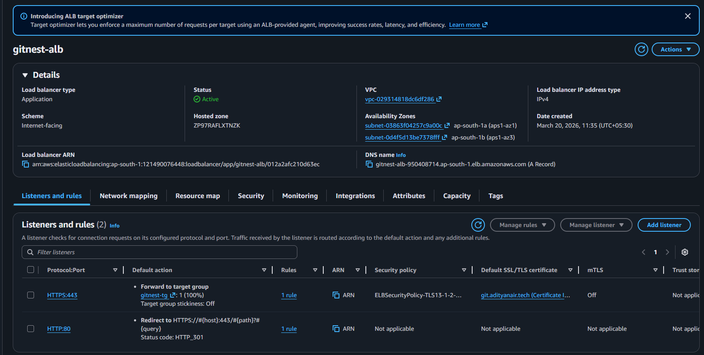
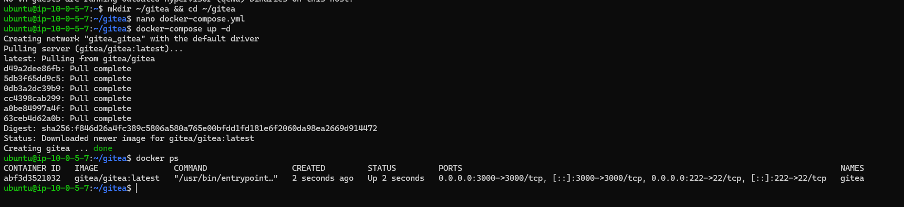
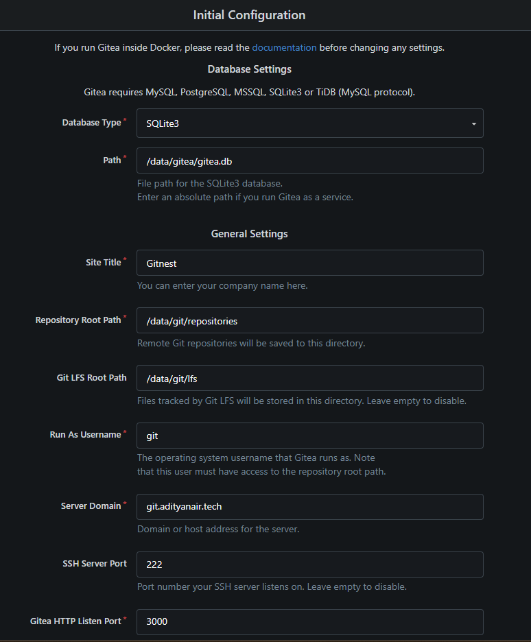
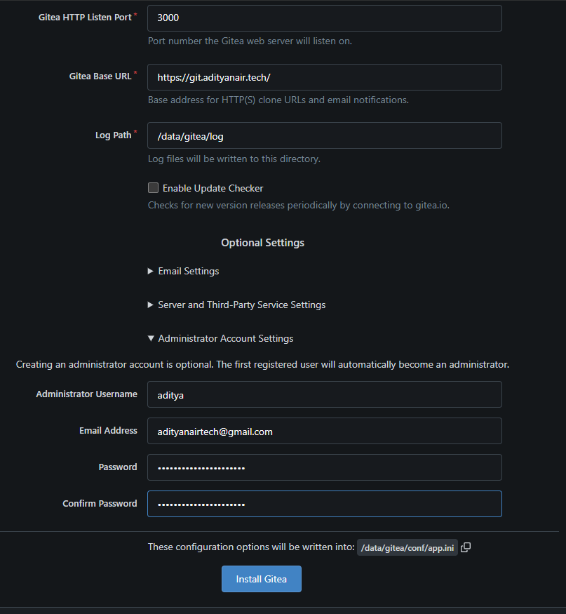

# GITNEST


# 🏆 GitNest — Self-Hosted Git Hosting Platform on AWS

A self-hosted Git platform built on AWS, mimicking GitHub using **Gitea**. Runs on EC2 with persistent storage via EFS, fronted by an Application Load Balancer with HTTPS via ACM. Live at [git.adityanair.tech](https://git.adityanair.tech) till 24/3/26.

---

## Screenshots

All the Images are located in the [`/images`](./images) folder in the cronological order.

### Code pushed to git tea hosted on git.adityanair.tech



---

## Architecture

```
User (HTTPS)
     |
     v
get.tech DNS (CNAME → ALB)
     |
     v
ALB - gitnest-alb (HTTPS:443 / HTTP:80 redirect)
     |         |
     |    ACM Certificate (git.adityanair.tech)
     |
     v
EC2 - gitnest-server (Ubuntu 24.04 / t3.micro)
     |         |
     |    Docker → Gitea container (port 3000)
     |
     v
EFS - gitnest-efs (NFS mount at /mnt/efs/gitea)
     |
     v
Git Repositories, SQLite DB, Gitea config
```

---

## AWS Services Used

| Service | Purpose |
|---|---|
| EC2 (t3.micro) | Hosts Gitea Docker container |
| EFS | Persistent Git repository storage |
| ALB | HTTPS termination + load balancing |
| ACM | Free SSL/TLS certificate |
| VPC | Isolated network with public subnets |
| Security Groups | Layered access control (ALB → EC2 → EFS) |
| IAM | Scoped instance permissions |

---

## DevOps Tools Used

| Tool | Purpose |
|---|---|
| Docker | Runs Gitea as a container on EC2 |
| Docker Compose | Manages container lifecycle |

---

## Security Design

```
Internet
   |
   | HTTPS:443 only
   v
gitnest-alb-sg
   |
   | Port 3000 — ALB SG source only
   v
gitnest-ec2-sg
   |
   | Port 2049 (NFS) — EC2 SG source only
   v
gitnest-efs-sg
```

- EC2 is never directly exposed to the internet
- EFS is only accessible from EC2
- SSH access restricted to known IP only

---

## Key Concepts Demonstrated

- EFS as persistent shared storage for stateful containerized apps
- ALB HTTPS termination with ACM certificate
- Security group chaining (ALB → EC2 → EFS)
- Docker containerization of self-hosted tools on EC2
- Custom subdomain with SSL (`git.adityanair.tech`)
- NFS mount for network file systems on Ubuntu

---


## docker-compose.yml

```yaml
version: "3"

networks:
  gitea:
    external: false

services:
  server:
    image: gitea/gitea:latest
    container_name: gitea
    environment:
      - USER_UID=1000
      - USER_GID=1000
    restart: always
    networks:
      - gitea
    volumes:
      - /mnt/efs/gitea:/data
    ports:
      - "3000:3000"
      - "222:22"
```

---

## Build Phases

| Phase | What Was Done |
|---|---|
| Phase 0 | ACM certificate issued for `git.adityanair.tech` |
| Phase 1 | VPC + 3 security groups (ALB, EC2, EFS) |
| Phase 2 | EFS file system with mount targets in 2 AZs |
| Phase 3 | EC2 launched, EFS mounted via NFS, Gitea deployed via Docker |
| Phase 4 | ALB created with HTTPS listener + HTTP→HTTPS redirect |
| Phase 5 | Gitea configured with domain, HTTPS base URL, admin account |
| Phase 6 | Repo created, code pushed, EFS persistence verified |

---

## Configurations of AWS and git tea


### VPC

---
### EC2 Network settings

---
### EFS Network 

---
### Active Application Load Balancer

---
### Docker Compose


### Git Tea First time configuration




## Live Demo

- Platform URL: [https://git.adityanair.tech](https://git.adityanair.tech) 
- Region: ap-south-1 (Mumbai)

---
## 👨‍💻 Author

**Aditya Nair**
- GitHub: [@ADITYANAIR01](https://github.com/ADITYANAIR01)
- LinkedIn: [linkedin.com/in/adityanair001](https://www.linkedin.com/in/adityanair001)

---