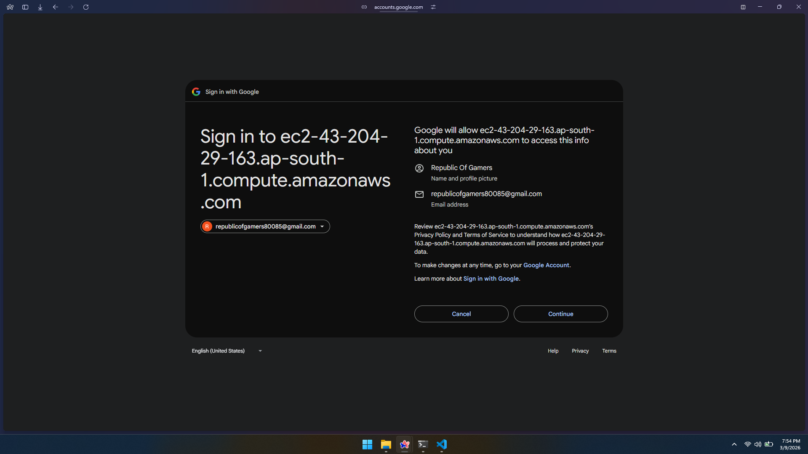
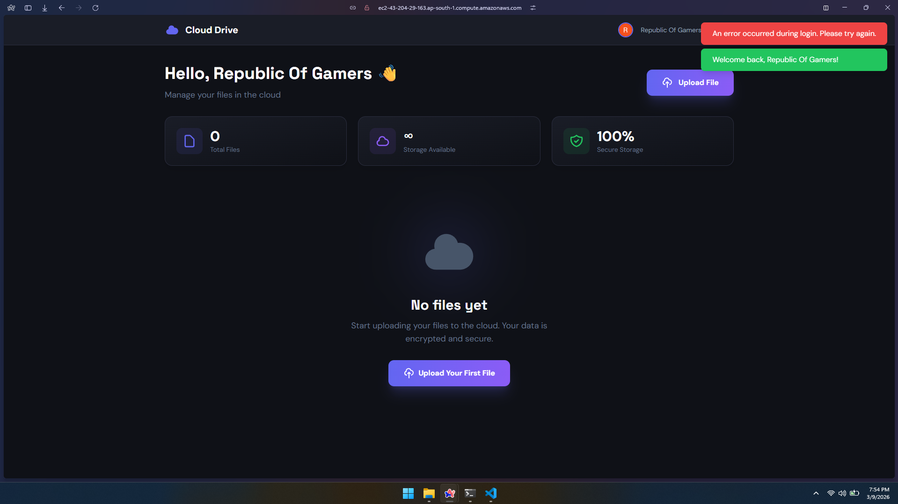
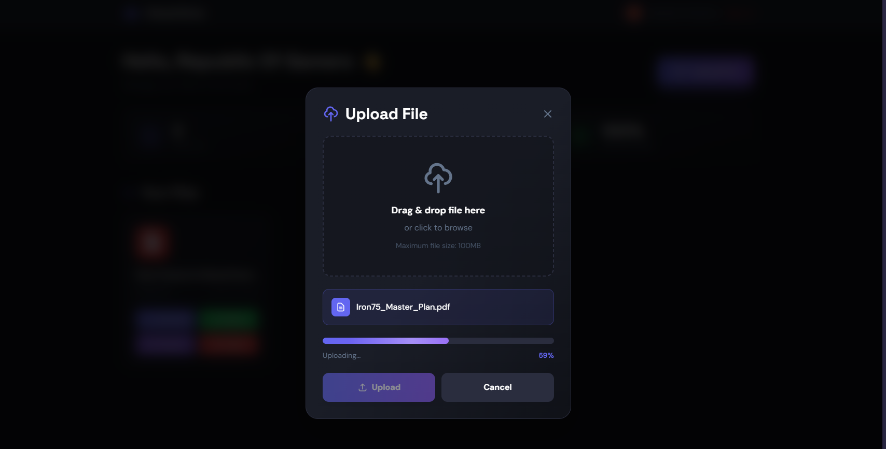
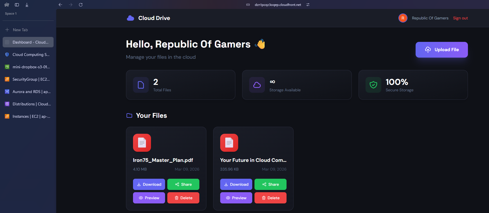
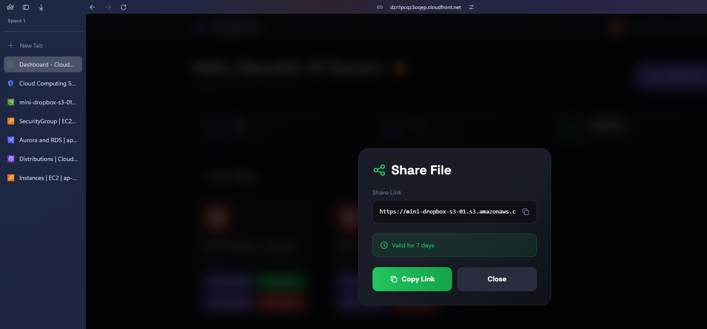
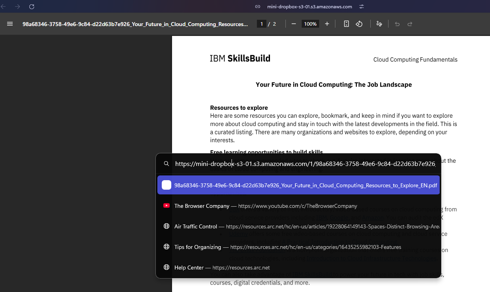

# 📦 Mini Dropbox — Cloud File Storage on AWS

> A fully functional cloud file storage platform built on AWS — mimicking core Dropbox features including file upload, download, delete, and shareable links with Google OAuth authentication.

> **App URL:** `https://dzn1pcqz3oqep.cloudfront.net/files/`
> **Status: Not Live**  on AWS EC2 (ap-south-1 · Mumbai)

---

## 📸 Screenshots

> All build screenshots are available in the [`/images`](./images) folder, numbered `1` through `45` in chronological build order.

### Login Page  


--------

### Dashboard 

---
### File upload 

---
### Dashboard view with files

---
### Share link 

---

### Preview Link Fron mini-dropbox


---

## 🧰 Tech Stack

| Layer | Technology |
|---|---|
| Backend | Python 3.11 + Flask |
| Frontend | HTML5 + Tailwind CSS + Vanilla JS |
| Auth | Google OAuth 2.0 (Authlib) |
| File Storage | AWS S3 |
| Database | AWS RDS PostgreSQL 16 |
| CDN | AWS CloudFront |
| Web Server | Nginx + Gunicorn |
| Compute | AWS EC2 (Ubuntu 22.04) |
| Monitoring | AWS CloudWatch |

---

## ☁️ AWS Architecture

```
┌─────────────────────────────────────────────────────────────────────┐
│                          INTERNET                                   │
└───────────────────────────┬─────────────────────────────────────────┘
                            │
                            │ HTTPS / HTTP
                            ▼
┌─────────────────────────────────────────────────────────────────────┐
│                    AWS CLOUD  (ap-south-1 · Mumbai)                 │
│                                                                     │
│   ┌──────────────────────────────────────────────────────────────┐  │
│   │                  DEFAULT VPC                                 │  │
│   │                                                              │  │
│   │   ┌──────────────────────┐                                   │  │
│   │   │   CloudFront (CDN)   │ ◄── Static files & previews       │  │
│   │   │  (Global Edge Cache) │     served globally               │  │
│   │   └──────────┬───────────┘                                   │  │
│   │              │                                               │  │
│   │              │ Origin request                                │  │
│   │              ▼                                               │  │
│   │   ┌──────────────────────────────────────────────────────┐   │  │
│   │   │            EC2  (t2.micro · Ubuntu 22.04)            │   │  │
│   │   │         Security Group: mini-dropbox-ec2-sg          │   │  │
│   │   │          Ports: 22 (SSH) · 80 (HTTP) · 5000          │   │  │
│   │   │                                                      │   │  │
│   │   │   ┌─────────────┐       ┌─────────────────────────┐  │   │  │
│   │   │   │    Nginx    │──────►│   Gunicorn (WSGI)       │  │   │  │
│   │   │   │  (Port 80)  │       │   2 workers · Port 5000 │  │   │  │
│   │   │   │  Rev. Proxy │       └──────────┬──────────────┘  │   │  │
│   │   │   └─────────────┘                  │                 │   │  │
│   │   │                                    ▼                 │   │  │  
│   │   │                        ┌───────────────────────┐     │   │  |
│   │   │                        │   Flask Application   │     │   │  |
│   │   │                        │  ┌─────────────────┐  │     │   │  |
│   │   │                        │  │  auth.py        │  │     │   │  |
│   │   │                        │  │  Google OAuth   │  │     │   │  |
│   │   │                        │  └─────────────────┘  │     │   │  |
│   │   │                        │  ┌─────────────────┐  │     │   │  |
│   │   │                        │  │  files.py       │  │     │   │  |
│   │   │                        │  │  upload/delete  │  │     │   │  |
│   │   │                        │  │  share/preview  │  │     │   │  |
│   │   │                        │  └─────────────────┘  │     │   │  |
│   │   │                        │  ┌─────────────────┐  │     │   │  |
│   │   │                        │  │  s3.py + db.py  │  │     │   │  |
│   │   │                        │  └─────────────────┘  │     │   │  |
│   │   │                        └──────┬──────────┬──────┘    │   │  |
│   │   │    IAM Role attached          │          │           │   │  |
│   │   │    (No hardcoded keys)        │          │           │   │  |
│   │   └───────────────────────────────┼──────────┼───────────┘   │  |
│   │                                   │          │               |  │ 
│   │              ┌────────────────────┘          └──────────────┐|  |
│   │                                                              |  |
│   │              │ S3 API (boto3)                 psycopg2 :5432 │  │
│   │              ▼                                               ▼  │  
│   │   ┌─────────────────────┐         ┌──────────────────────────┐  │  
│   │   │      AWS S3         │         │   RDS PostgreSQL 16      │  │  
│   │   │  mini-dropbox-files │         │   mini-dropbox-db        │  │  
│   │   │                     │         │   (db.t3.micro)          │  │  
│   │   │  ┌───────────────┐  │         │   SG: rds-sg             │  │  
│   │   │  │ user_id/uuid_ │  │         │   (only EC2 SG allowed)  │  │ 
│   │   │  │ filename.ext  │  │         │                          │  │  
│   │   │  │ (private)     │  │         │  ┌──────────────────┐    │  │  
│   │   │  └───────────────┘  │         │  │ users table      │    │  │  
│   │   │                     │         │  │ files table      │    │  │ 
│   │   │  Access via:        │         │  └──────────────────┘    │  │  
│   │   │  Pre-signed URLs    │         └──────────────────────────┘  │ 
│   │   │  (15min download)   │                                    │  │
│   │   │  (7day share link)  │                                    │  │
│   │   └─────────────────────┘                                    │  │
│   │                                                              │  │
│   └──────────────────────────────────────────────────────────────┘  │
│                                                                     │
│   ┌──────────────┐   ┌──────────────┐   ┌──────────────────────┐    │
│   │     IAM      │   │  CloudWatch  │   │    Google OAuth      │    │
│   │  EC2 Role    │   │  Monitoring  │   │  (External · HTTPS)  │    │
│   │  S3 Access   │   │  Logs+Alarms │   │  email+profile+id    │    │
│   └──────────────┘   └──────────────┘   └──────────────────────┘    │
│                                                                     │
└─────────────────────────────────────────────────────────────────────┘
```

### Request Flow

```
 Upload File                          Download / Share
 ───────────                          ────────────────
 Browser                              Browser
    │ POST /files/upload                 │ GET /files/download/<id>
    ▼                                    ▼
 Nginx → Flask                        Nginx → Flask
    │ secure_filename()                  │ verify ownership (RDS)
    │ generate s3_key                    │ generate pre-signed URL
    ▼                                    ▼
 S3 (store file)                      S3 (generate temp URL)
    │                                    │
    ▼                                    ▼
 RDS (store metadata)                 Redirect → Browser downloads
```

### Security Design

```
 Internet
    │
    │  ✅ HTTP/HTTPS only
    ▼
 EC2 (mini-dropbox-ec2-sg)
    │  Port 22  ← Your IP only (SSH)
    │  Port 80  ← Anyone (web traffic)
    │
    │  ✅ IAM Role — no AWS keys in code
    │  ✅ Pre-signed URLs — S3 never public
    ▼
 RDS (mini-dropbox-rds-sg)
    │  Port 5432 ← EC2 Security Group ONLY
    │             (not open to internet)
    ▼
 S3 Bucket
    │  Block All Public Access ✅
    │  CORS configured ✅
    │  SSE-S3 Encryption ✅
```

---

## ✨ Features

| Feature | Description |
|---|---|
| 🔐 Google Sign In | OAuth 2.0 login — no password needed |
| 📤 File Upload | Drag & drop or click to upload, up to 100MB |
| 📋 File Dashboard | View all your files with type, size, and upload date |
| ⬇️ Download | Secure time-limited pre-signed S3 URL (15 min) |
| 🗑️ Delete | Remove file from S3 and metadata from RDS instantly |
| 🔗 Share Link | Generate a 7-day shareable pre-signed URL |
| 👁️ Preview | Open images and PDFs directly in browser via CloudFront |
| 📊 File Icons | Visual icons per file type (PDF, image, video, zip, etc.) |

---

## 🗂️ Project Structure

```
mini-dropbox/
|---CODE
├── app/
│   ├── __init__.py          # Flask app factory
│   ├── config.py            # Environment config
│   ├── auth.py              # Google OAuth routes
│   ├── files.py             # Upload, download, delete, share routes
│   ├── db.py                # RDS PostgreSQL operations
│   ├── s3.py                # S3 operations + pre-signed URLs
│   │
│   ├── templates/
│   │   ├── base.html        # Base layout with navbar
│   │   ├── login.html       # Google Sign-In page
│   │   └── dashboard.html   # File manager UI
│   │
│   └── static/
│       ├── css/style.css    # Custom styles
│       └── js/dashboard.js  # Upload, delete, share, preview logic
│
├── sql/
│   └── schema.sql           # RDS table definitions
│
├── docs/
│   └── screenshots/         # UI screenshots
│
├── .env.example             # Environment variable template
├── requirements.txt         # Python dependencies
├── run.py                   # App entry point
├── gunicorn.conf.py         # Production server config
└── README.md
```

---

## 🗄️ Database Schema

```sql
-- Users (from Google OAuth)
users (id, google_id, email, name, profile_picture, created_at)

-- Files (metadata only — actual files live in S3)
files (id, user_id, filename, original_name, s3_key,
       file_size, file_type, uploaded_at, share_token)
```

---

## 🚀 How to Deploy

### Prerequisites
- AWS Account with Free Tier
- Google Cloud Console account
- EC2 instance (Ubuntu 22.04, t2.micro)
- RDS PostgreSQL instance (db.t3.micro)
- S3 bucket (private)

### 1. Clone the repo
```bash
git clone https://github.com/ADITYANAIR01/AWS.git
cd mini-dropbox
```

### 2. Install dependencies
```bash
sudo apt update && sudo apt install -y python3 python3-pip nginx postgresql-client
sudo pip3 install -r requirements.txt
```

### 3. Configure environment
```bash
cp .env.example .env
nano .env   # Fill in all values
```

### 4. Initialize database
```bash
python3 -c "
from app import create_app
from app.db import init_db
app = create_app()
with app.app_context():
    init_db()
"
```

### 5. Configure Nginx
```bash
sudo nano /etc/nginx/sites-available/mini-dropbox
# Paste nginx config (see docs below)
sudo ln -s /etc/nginx/sites-available/mini-dropbox /etc/nginx/sites-enabled/
sudo systemctl restart nginx
```

### 6. Run with Gunicorn
```bash
sudo systemctl start mini-dropbox
sudo systemctl enable mini-dropbox
```

---

## 🔧 Environment Variables

```bash
# Flask
FLASK_SECRET_KEY=your-secret-key
FLASK_ENV=production

# Google OAuth
GOOGLE_CLIENT_ID=xxxx.apps.googleusercontent.com
GOOGLE_CLIENT_SECRET=GOCSPX-xxxx
GOOGLE_REDIRECT_URI=http://YOUR-EC2-IP/auth/callback

# AWS
AWS_REGION=ap-south-1
S3_BUCKET_NAME=your-bucket-name
CLOUDFRONT_DOMAIN=your-cloudfront-domain.cloudfront.net

# RDS
DB_HOST=your-rds-endpoint.amazonaws.com
DB_PORT=5432
DB_NAME=minidropbox
DB_USER=dbadmin
DB_PASSWORD=your-password
```

---

## 🔐 AWS IAM & Security Design

- **IAM Role** (`mini-dropbox-ec2-role`) attached to EC2 — no AWS keys in code
- **S3 bucket** is fully private — no public access allowed
- **Files served** via pre-signed URLs with expiry (download: 15 min, share: 7 days)
- **RDS** has no public access — only reachable from EC2 via Security Group
- **Security Groups** — RDS SG allows inbound only from EC2 SG (not open to internet)

---

## 📡 API Routes

| Method | Route | Description |
|---|---|---|
| GET | `/auth/login` | Redirect to Google OAuth |
| GET | `/auth/callback` | Handle Google OAuth callback |
| GET | `/auth/logout` | Clear session + redirect to login |
| GET | `/` | Dashboard — list user's files |
| POST | `/files/upload` | Upload file to S3 + save metadata |
| GET | `/files/download/<id>` | Generate pre-signed download URL |
| POST | `/files/delete/<id>` | Delete from S3 + RDS |
| POST | `/files/share/<id>` | Generate 7-day shareable link |
| GET | `/files/preview/<id>` | Get CloudFront preview URL |

---

## 💡 Cloud Concepts Demonstrated

- **Object Storage** — S3 as scalable file storage (not server disk)
- **Pre-signed URLs** — Secure, temporary access to private S3 objects
- **CDN** — CloudFront for fast global file delivery
- **Multi-tier architecture** — EC2 (compute) + S3 (storage) + RDS (database) separated
- **IAM Roles** — EC2 to S3 auth without hardcoded credentials
- **Security Groups** — Network-level access control between services
- **Managed Database** — RDS handles backups, patching, availability
- **Process Management** — Gunicorn + systemd for production reliability
- **Reverse Proxy** — Nginx routing traffic to Flask app

---

## 📊 AWS Services Used

| Service | Purpose | Free Tier |
|---|---|---|
| EC2 t2.micro | App server | 750 hrs/month |
| RDS db.t3.micro | PostgreSQL database | 750 hrs/month |
| S3 | File storage | 5GB storage |
| CloudFront | CDN / file delivery | 1TB transfer/month |
| IAM | Roles & permissions | Always free |
| CloudWatch | Monitoring & logs | 10 metrics free |
GCP Google Oauth Client| for login with google

---
## 👨‍💻 Author

**Aditya Nair**
- GitHub: [@ADITYANAIR01](https://github.com/ADITYANAIR01)
- LinkedIn: [linkedin.com/in/adityanair001](https://www.linkedin.com/in/adityanair001)

---