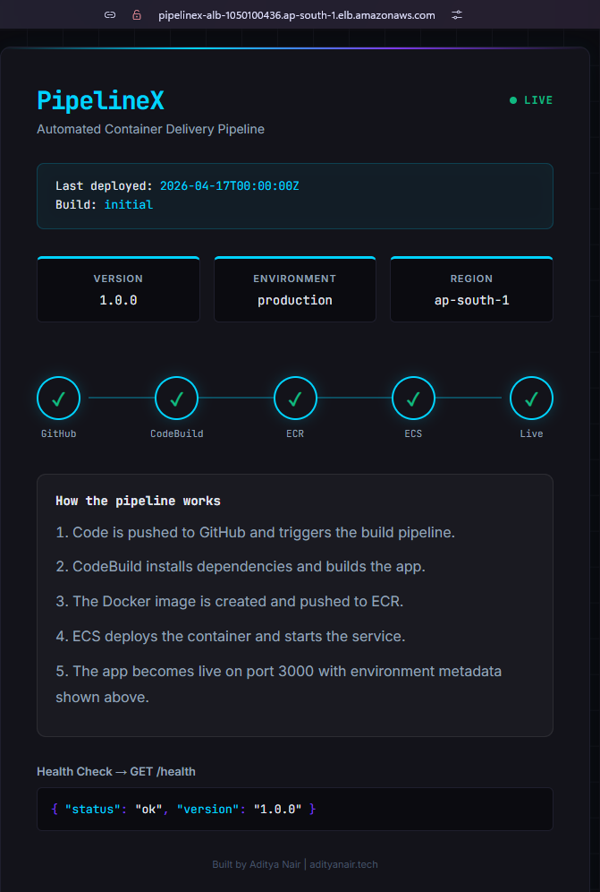
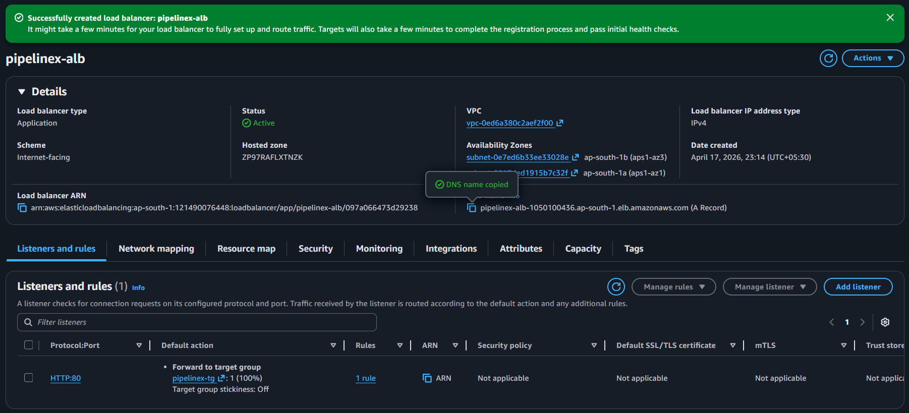
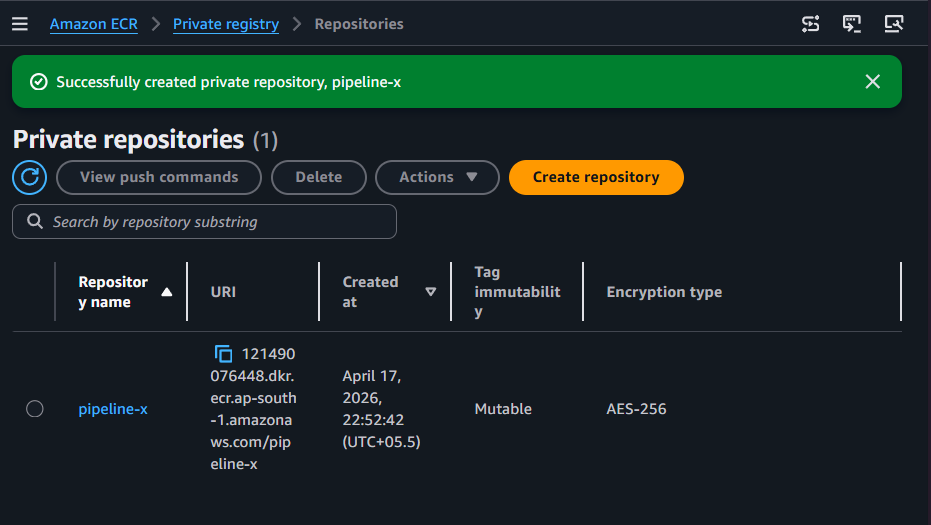
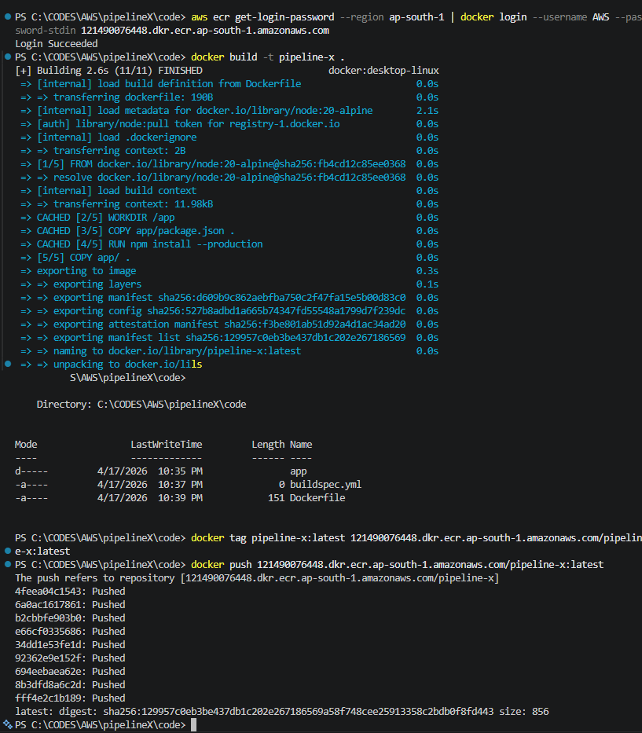
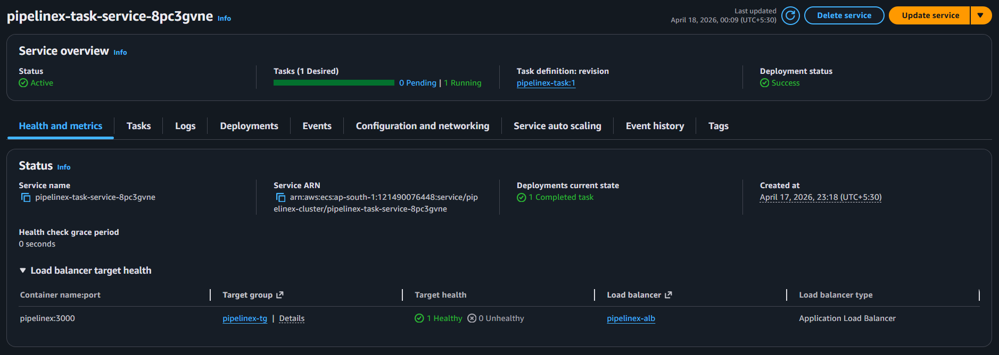

# PipelineX

Automated container delivery pipeline built on AWS.
Push code to GitHub — a fully automated CI/CD pipeline builds the Docker image,
pushes it to ECR, and deploys it to ECS Fargate with zero manual steps.

---

## Screenshots

All images are located in the [`/images`](./images) folder in chronological order.

### Application UI



### Application Load Balancer



### ECR — image created



### Pushed code to ECR



### Task Service



---

## Architecture

```text
GitHub Push
    |
    v
GitHub Actions (trigger)
    |
    v
CodeBuild (build Docker image)
    |
    v
ECR (store image)
    |
    v
ECS Fargate (run containers)
    |
    v
ALB (route traffic)
    |
    v
Users
```

---

## Stack

- **CI/CD:** GitHub Actions, AWS CodeBuild
- **Container registry:** Amazon ECR
- **Container orchestration:** Amazon ECS (Fargate)
- **Load balancing:** Application Load Balancer
- **IAM:** Scoped roles for CodeBuild, ECS task, GitHub Actions
- **Observability:** CloudWatch Logs

---

## Pipeline flow

1. Developer pushes to `main` branch
2. GitHub Actions authenticates to AWS and triggers CodeBuild
3. CodeBuild builds Docker image, tags with commit SHA, pushes to ECR
4. CodeBuild triggers ECS service update (`force-new-deployment`)
5. ECS pulls new image from ECR, performs rolling deployment
6. ALB routes traffic to healthy tasks

---

## Key concepts demonstrated

- Container image build automation
- Private container registry (ECR) with IAM auth
- Serverless container runtime (Fargate) — no EC2 to manage
- Rolling deployments with zero downtime
- Scoped IAM identities per component (least privilege)
- Build artifact tagging with Git commit SHA

---

## Project structure

```text
pipelinex
|─ code/
├─── app/
│   ├── server.js
│   ├── package.json
│   └── public/
│       └── index.html
├── Dockerfile
├── buildspec.yml
└── .github/
    └── workflows/
        └── deploy.yml
```

---

## 👨‍💻 Author

### Aditya Nair

- GitHub: [@ADITYANAIR01](https://github.com/ADITYANAIR01)

- LinkedIn: [linkedin.com/in/adityanair001](https://www.linkedin.com/in/adityanair001)

- Portfolio [adityanair.tech](https://www.adityanair.tech)
