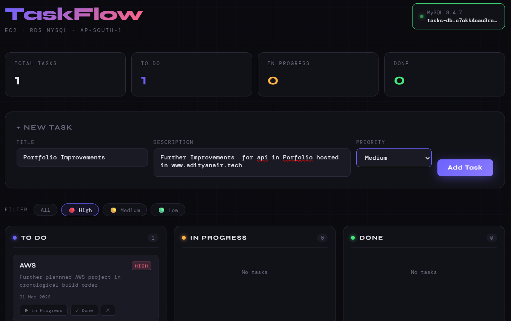
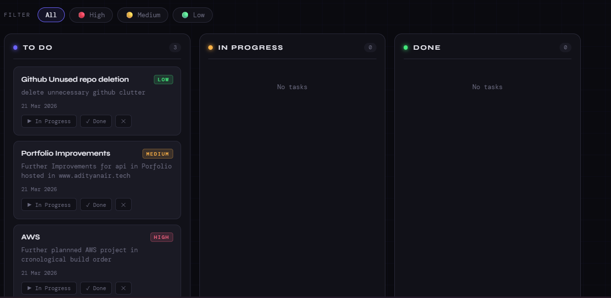
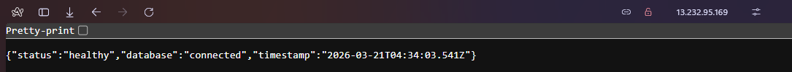
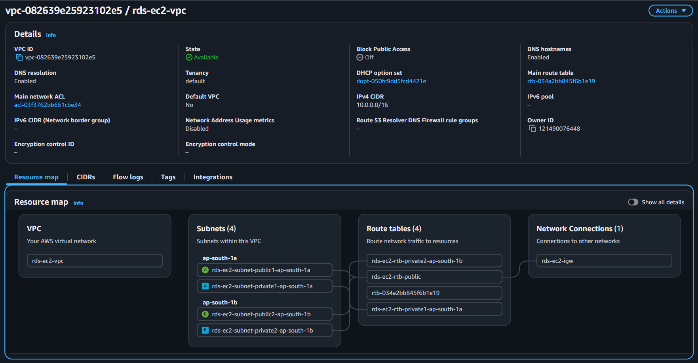
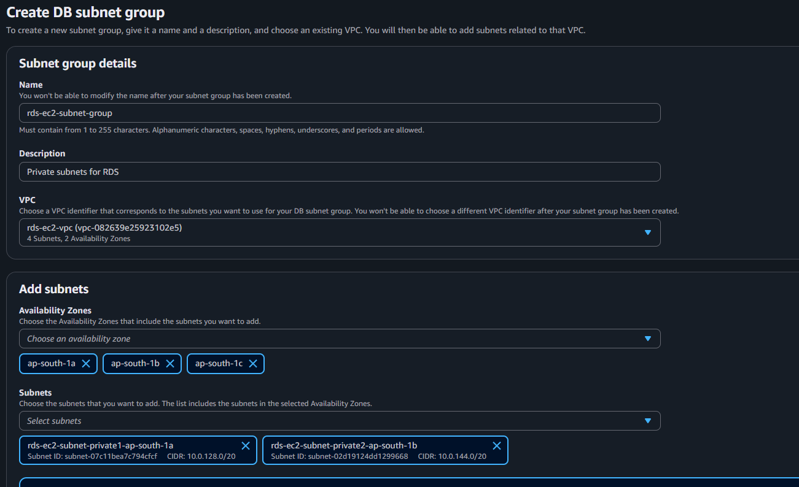
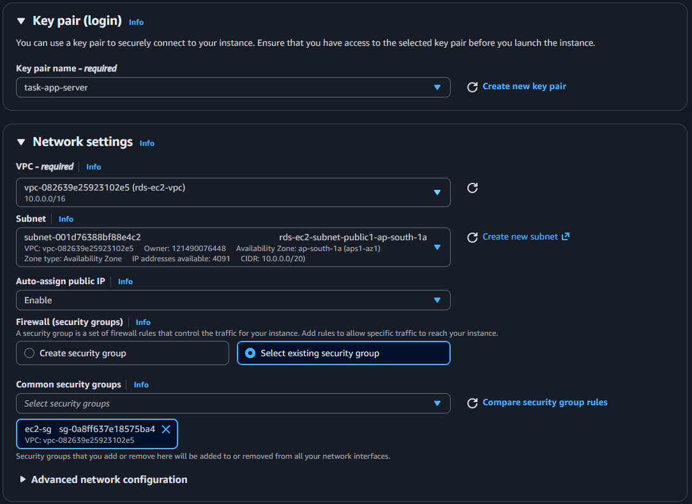
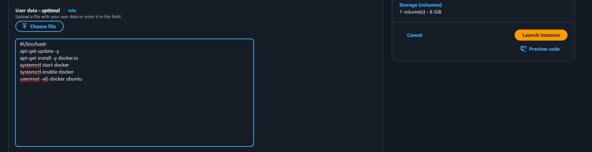

# RDS + EC2 Web App — TaskFlow

A full-stack task manager running in Docker on EC2, backed by Amazon RDS MySQL.
Demonstrates secure EC2 ↔ RDS connectivity using VPC subnet isolation and Security Group chaining.

## Screenshots

> All build screenshots are available in the [`/images`](./images) folder, numbered `1` through `29` in chronological build order.

### App — Tasks Board

---

### Added Todo's with differnt priorities

---
### Health Endpoint

---
### VPC Resource Map

---
### RDS — Private Subnet

---
### EC2 Network Settings

---
### EC2 additional user data for automatically updating and downloading Docker at startup 

---
## Architecture
```
Internet
    |
    v
EC2 t2.micro (Public Subnet — ap-south-1)
  └── Docker: Node.js + Express
        |
        v (port 3306, private only)
RDS MySQL 8.0 (Private Subnet — ap-south-1)
  └── taskmanager database
```

## AWS Services Used

| Service | Role |
|---|---|
| EC2 (t2.micro, Ubuntu 24.04) | Application server |
| RDS MySQL 8.0 (db.t3.micro) | Managed relational database |
| VPC | Custom network with public + private subnets |
| Security Groups | EC2 open on 80/22 · RDS open on 3306 to EC2 only |
| IAM | EC2 key pair access |

## Key Concepts Demonstrated

- RDS in private subnet — no public IP, not internet-accessible
- Security Group chaining — RDS SG source is EC2 SG, not an IP range
- Docker on EC2 — containerized app with environment variable injection
- DB connection pooling — mysql2 pool with reconnect handling
- Health check endpoint — `/health` returns live DB connectivity status

## Security Design
```
EC2 (Public Subnet)           RDS (Private Subnet)
+--------------------+        +----------------------+
| ec2-sg             |        | rds-sg               |
| Inbound:           |------->| Inbound:             |
|  22  (My IP)       | :3306  |  3306 (ec2-sg only)  |
|  80  (0.0.0.0/0)   |        |  No public access    |
+--------------------+        +----------------------+
```

## App Features

- Kanban board — To Do / In Progress / Done columns
- Task priority — High / Medium / Low with color coding
- Priority filter — filter tasks by priority level
- Live stats — task counts update automatically
- DB connection badge — shows RDS host + MySQL version + live status
- Health endpoint — `/health` for infrastructure verification

## Environment Variables

| Variable | Description |
|---|---|
| DB_HOST | RDS endpoint |
| DB_USER | Database username |
| DB_PASSWORD | Database password |
| DB_NAME | Database name (taskmanager) |

## Run with Docker
```bash
docker run -d --name taskapp -p 80:3000 -e DB_HOST=tasks-db.c7okk4cau3rc.ap-south-1.rds.amazonaws.com -e DB_USER=admin -e DB_PASSWORD=<YOUR-RDS-PASSWORD> -e DB_NAME=taskmanager --restart unless-stopped taskapp
```

## Verify
```bash
# Check container
docker ps
docker logs taskapp

# Health check
curl http://<EC2-IP>/health
```
---
## 👨‍💻 Author

**Aditya Nair**
- GitHub: [@ADITYANAIR01](https://github.com/ADITYANAIR01)
- LinkedIn: [linkedin.com/in/adityanair001](https://www.linkedin.com/in/adityanair001)

---
